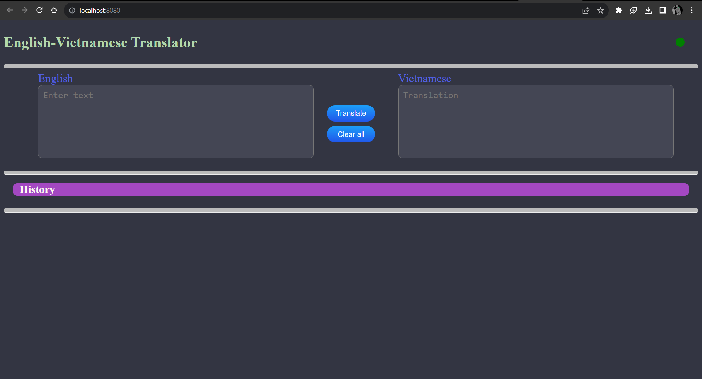
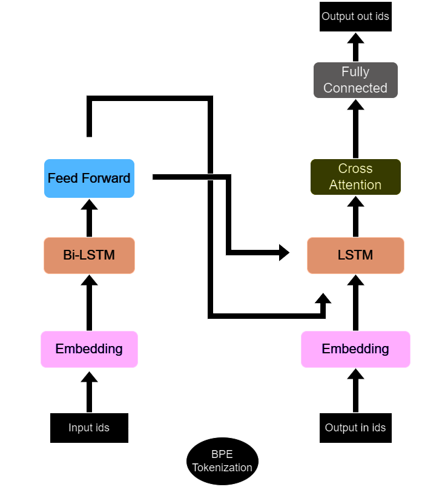

# Neural Machine Translation
- Note: this project will no longer be updated. Check out the latest version of my `Machine Translation` project [here](https://github.com/hsthe29/Translation). Thank you.

# Overview
Implementation and deployment of the machine translation application as a web application

# Model:
- RNN-based with Transformer-like architecture:

# Usage

Clone this repository: ``

Edit model configuration in [config.json](config/config.json)

Edit argument in [train.sh](train.sh)

Training

    $ sh .\train.sh (Windows)
    $ train.sh (Linux)

Or download model's weights at [drive]()

## Deployment
I deployed the application in a very simple way on my local machine using the `http` library

Basical usage: Run the following command with terminal:

    $ sh .\start-app.sh (Windows)
    $ start-app.sh (Linux)

Recommended TensorFlow version: `2.13.x`

## Web Interface


# Project Descriptions
## Dataset
I used [PhoMT](https://github.com/VinAIResearch/PhoMT) from VinAIResearch for this project. For more information about PhoMT, Please click on the link I placed in the previous line. 

## Model
### 1. Using RNN


Base config:
```
- num_layers = 2
- hidden_units = 256
- embedding_size = 256
- dropout_rate = 0.1,
- max_length = 128,
- vocab_size = 16000 (bpe.16k)
```

### 2. Transformer 

### 3. Graph NN

## Learning rate schedule
### Warmup Schedule
```math
lr = d_{model}^{-0.5}*min(step\_num^{-0.5}, step\_num*warmup\_steps^{-1.5})
```

### Warmup Linear Schedule
```math
lr = \begin{cases}
init\_lr*\frac{step}{warmup\_steps}, & step < warmup\_steps \\
init\_lr*\frac{train\_steps - step}{train\_steps - warmup\_steps}, & otherwise
\end{cases}
```

### Stair Reduction Schedule
```math

```

## Training and Inference
Train on the PhoMT dataset with the following parameters:
- Epochs = 25
- Steps per epoch = 20000
- Batch size = 32
- Learning rate reduction proportion = 0.96
- 

Visit each model's [folder](thehs/model) to see the training and inference results.


# Next Steps
1. 
