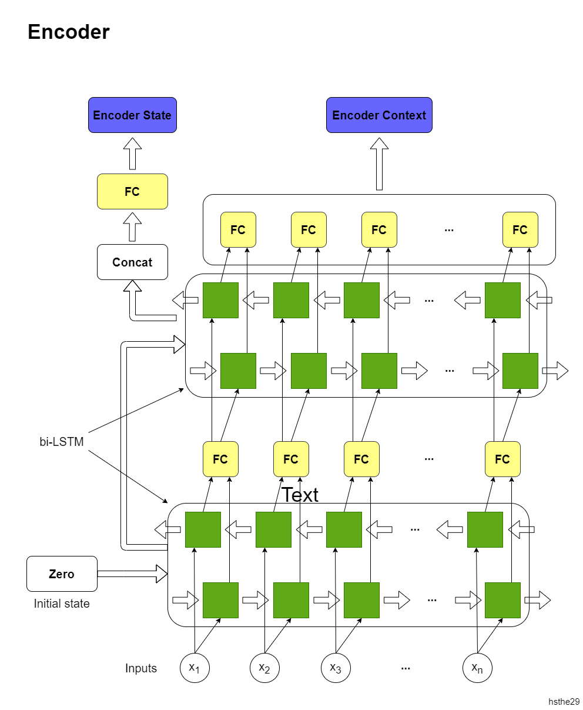
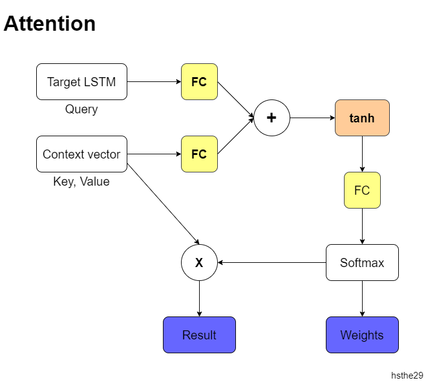
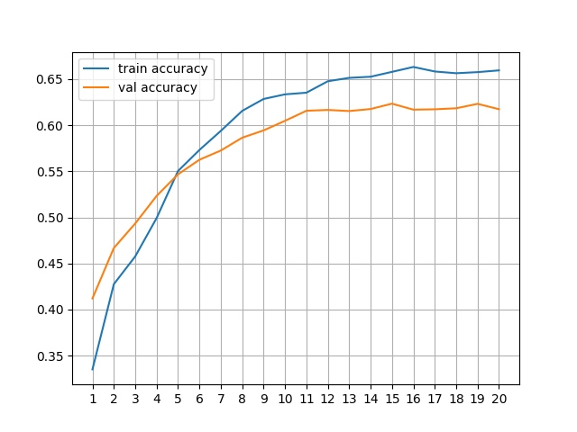

# Neural Machine Translation

## Overview
Mô hình dịch máy dùng LSTM cho Encoder-Decoder

Development: Modify NMT base model: [Link](https://www.tensorflow.org/text/tutorials/nmt_with_attention). See details below.

### Dataset
I used the dataset [PhoMT](https://github.com/VinAIResearch/PhoMT) from VinAIResearch. PhoMT is a high-quality and large-scale Vietnamese-English parallel dataset of 3.02M sentence pairs. For my project, I used training consist of 1.28M of 2.9M sentence pairs from `train.en` and `train.vi`. The validation set is taken from `dev.en` and `dev.vi` (15K pairs), test set is from `test.en` and `test.vi` (almost 20K pairs).

### Seq2seq model
- Using RNN 
- Orinial: Reference: [Google Tensorflow Example](https://www.tensorflow.org/text/tutorials/nmt_with_attention)
### Modify:
Multi-RNN NMT:
 - Generalization: `n` -> number of stage using in Encoder/Decoder. Each stage includes:
   - Encoder: `n` groups - `Bidirectional LSTM`
   - Decoder: `n` groups - `LSTM + Attention`
   - In my implementation, `n = 2`
#### Encoder

#### Attention

#### Decoder
I'm drawing

## Training
- Optimizer: Adam optimizer
- Leaning rate: initialize 1e-3, and decreased by 0.1 times every epoch after 20 epoches
- ```
  history = model.fit(train_ds.repeat(), 
                      epochs=50, 
                      steps_per_epoch = 2500, 
                      validation_data=val_ds, 
                      callbacks=[early_stopping, checkpoint])
  ```
- In training phase:
  - Loss


  - Accuracy



## Inference
- In inference phase, 

## Result
### BLEU Score
- I use Google Colaboratory to train and test model, so i will update BLEU metrics into this project

Model | BLEU
:---: | :---:
RNN | 19.425
Modified | not yet tested
- **Note:** I still update model until my model get best score

### Examples


## Run project
1. Install required packages: `$ ./run_build.sh` or `$ bash run_build.sh`
2. Edit project's configuration in [config.py](config.py)
3. Normalized dataset: `$ python normalize_data.py`
4. For training: `$ python train.py`
5. For testing (evaluate metrics): `$ python test.py`
6. Using trained model to translate: `translate(texts)` in file [translate.py](translate.py)
