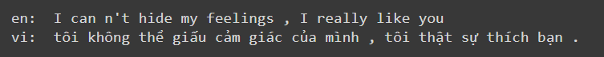
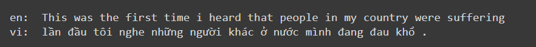
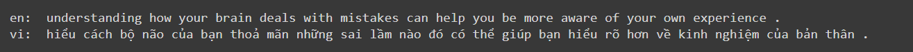

# Các công việc đã hoàn thành:

1. Tìm hiểu về các mô hình dịch máy:
    - Rule-based Machine Translation (RBMT)
    - Statistical machine translation (SMT)
    - Neural machine translation (NMT)
      - E-D (Encoder-Decoder)
      - Transformer
2. Xây dựng và huấn luyện được mô hình dịch máy cơ bản dùng mạng RNN (cụ thể là GRU)
   - Sử dụng cơ chế attention
3. Xử lý tập dữ liệu để đưa vào huấn luyện:
   - Chuẩn hóa về dạng lowercase
   - Xây dựng bộ từ vựng (vocabulary):
     - Gồm 8000 từ với tần suất xuất hiện lớn nhất
     - Loại bỏ các tên riêng trong từ vựng
     - Loại bỏ các từ có format là số
     - Loại bỏ các ký tự đặc biệt (symbol)
4. Training
   - Dùng 400.000 cặp câu để huấn luyện, trong đó phân chia 0.85 cho train và 0.15 để kiếm thử (validation)
   - Mô hình theo dõi độ chính xác trên tập kiểm thử và lưu lại mô hình tương ứng với độ chính xác (tính theo hàm masked_accuracy) lớn nhất
   - Dùng Early Stopping để ngắn quá trình huấn luyện nếu `val_masked_loss` không có sự cải thiện trong 5 epochs
   - Có khoảng 50 epochs
5. Kết quả:
    - Training: 
    - Accuracy: 
    - Attention: 
      - 
      - 
      - 
      - 
               
6. Kết quả khi dịch một số câu:
   
    
   
   

# Những công việc cần làm tiếp theo

1. Thử các mô hình khác và chọn mô hình hiệu quả hơn (Transformer)
2. Dịch từ Tiếng Việt -> Tiếng Anh
3. Xử lý các từ không nằm trong từ điển
4. Xử lý các câu văn bản tự nhiên trước khi đưa vào mô hình