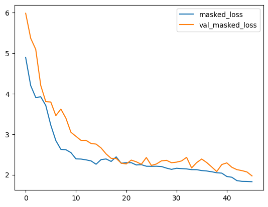
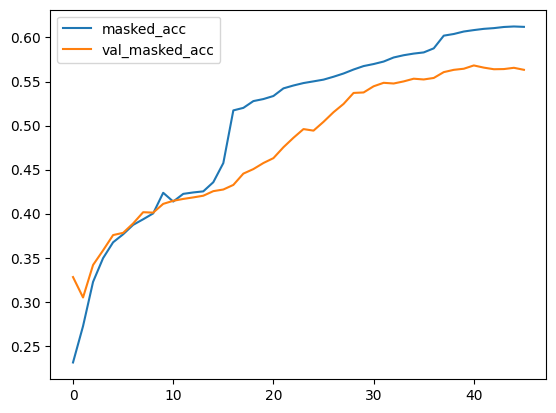
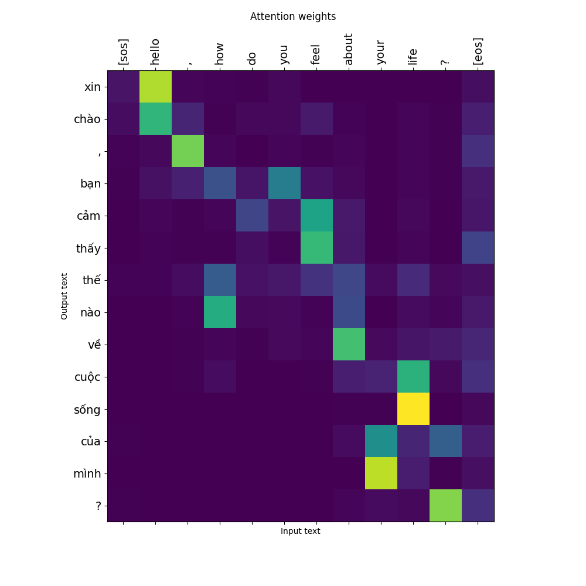
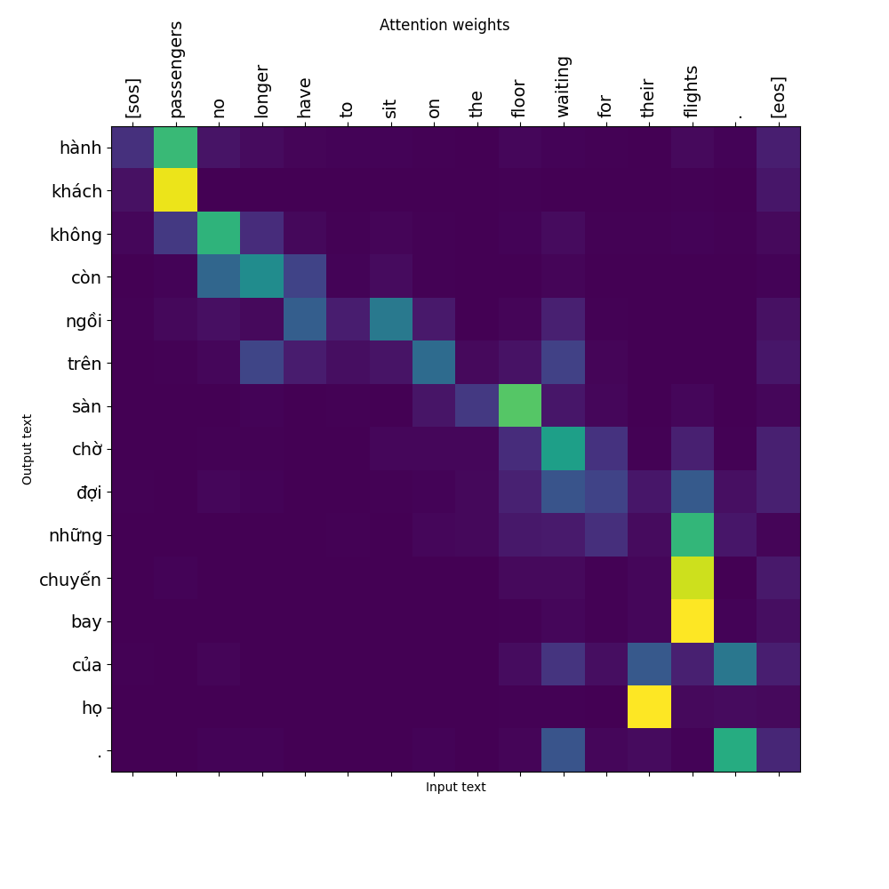
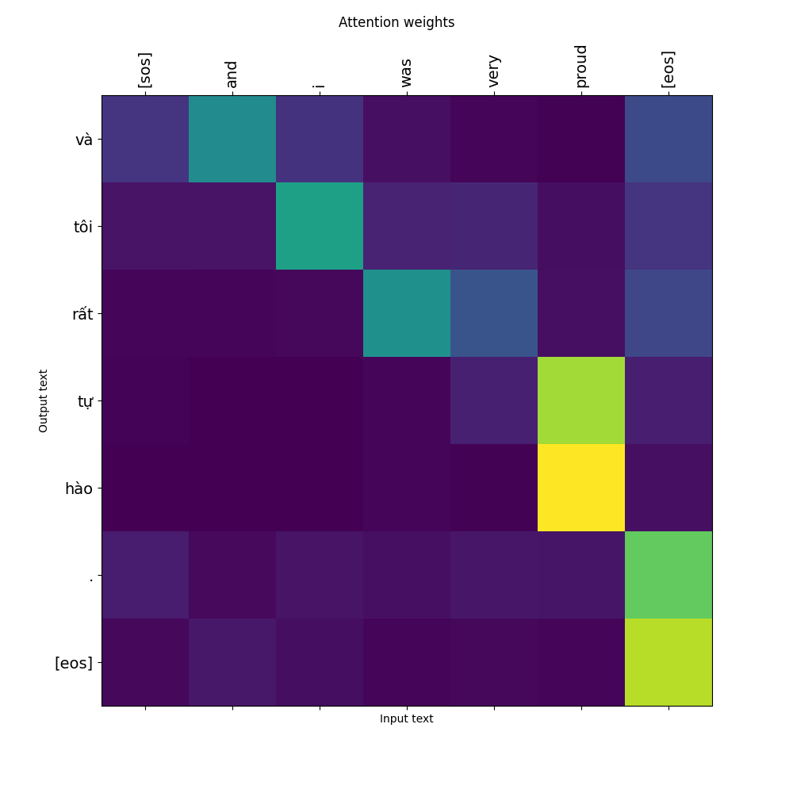
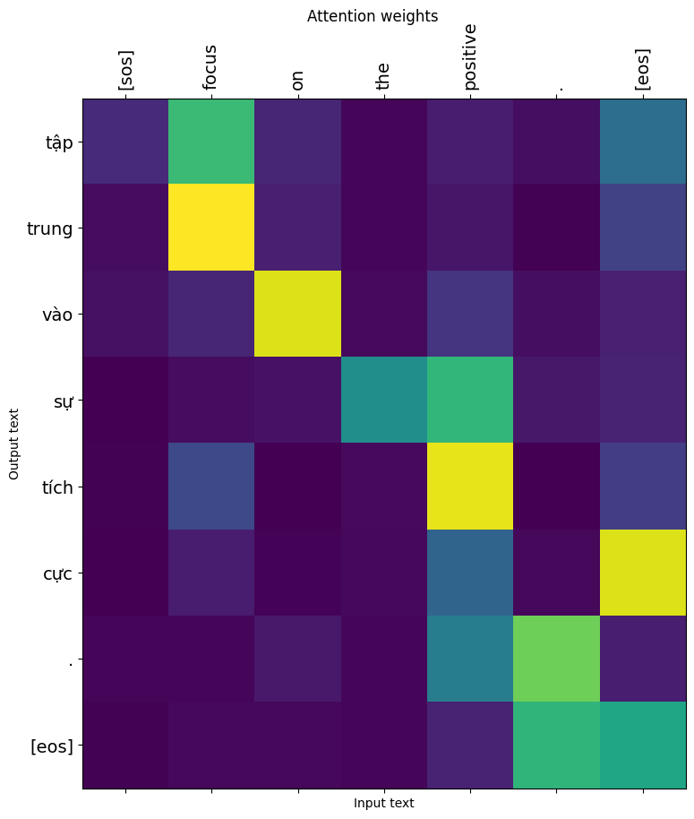
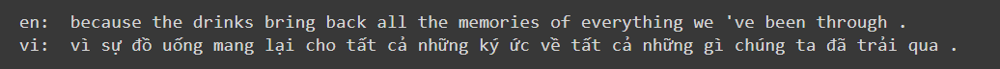

# Project: Dịch máy:
   - Dịch từ tiếng anh <-> tiếng việt
   - Repository: https://github.com/hsthe29/EncoderDecoder-NMT

# Các công việc đã hoàn thành:

1. Tìm hiểu về các mô hình dịch máy:
    - Rule-based Machine Translation (RBMT)
    - Statistical machine translation (SMT)
    - Neural machine translation (NMT)
      - E-D (Encoder-Decoder)
      - Transformer
2. Xây dựng và huấn luyện được mô hình dịch máy cơ bản dùng mạng RNN (cụ thể là GRU)
   - Sử dụng cơ chế attention
3. Xử lý tập dữ liệu để đưa vào huấn luyện:
   - Mã hóa `utf-8` và chuẩn hóa về dạng lowercase
   - Chuẩn hóa các dạng viết tắt:, các dấu. VD: `don't -> do n't`, `he's -> he 's`, `"hello" . -> " hello " . `
   - Dùng `backspace` để ngăn cách giữa các token và dùng thư viện `underthesea` để tokenize tiếng việt
   - Xây dựng bộ từ vựng (vocabulary):
     - Dùng bộ dữ liệu sau khi chuẩn hóa
     - Gồm 8000 từ với tần suất xuất hiện lớn nhất trong bộ 3 triệu câu
     - Loại bỏ các tên riêng trong từ vựng
     - Loại bỏ các từ có format là số
     - Loại bỏ các ký tự đặc biệt (symbol, các ký tự không nằm trong tiếng anh/tiếng việt)
4. Training
   - Dùng 400.000 cặp câu trong tập đã chuẩn hóa để huấn luyện, trong đó phân chia 0.85 cho train và 0.15 để kiếm thử (validation)
   - Mô hình theo dõi độ chính xác trên tập kiểm thử và lưu lại mô hình tương ứng với độ chính xác (tính theo hàm masked_accuracy) lớn nhất
   - Dùng Early Stopping để ngắn quá trình huấn luyện nếu `val_masked_loss` không có sự cải thiện trong 5 epochs
   - Có khoảng 50 epochs
   - Sau khi huấn luyện, lưu mô hình.
5. Kết quả:
    - Training: 
    - Accuracy: 
   
   **Nhận xét:** Độ chính xác của mô hình vẫn còn ở mức khá, cần phải tinh chỉnh mô hình hoặc tiền xử lý dữ liệu tốt hơn 

    - Attention: 
      - 
      - 
      - 
      - 

6. Kết quả khi dịch một số câu:
   
    
   
   

# Những công việc cần làm tiếp theo

1. Thử các mô hình khác và chọn mô hình hiệu quả hơn (Transformer)
2. Tiền xử lý dữ liệu tốt hơn
3. Dịch từ Tiếng Việt -> Tiếng Anh
4. Xử lý các từ không nằm trong từ điển
5. Dịch các câu dài chính xác hơn
6. Xử lý các câu văn bản tự nhiên trước khi đưa vào mô hình
7. Dịch sang các ngôn ngữ khác