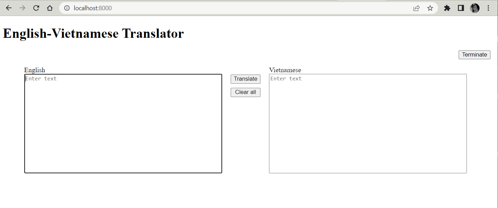
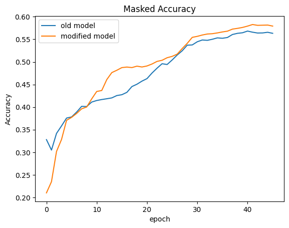

# Project: Dịch máy:
   - Dịch từ tiếng anh <-> tiếng việt
   - Repository: https://github.com/hsthe29/EncoderDecoder-NMT

# Các công việc đã hoàn thành:

1. [Report 1](REPORT_1.md)
2. Xây dựng lại các bước tiền xử lý dữ liệu.
3. Tinh chỉnh mô hình để thực hiện dịch các câu văn dài chính xác hơn
   - Mô hình cũ: Các output của Bidirectional GRU được tổng hợp bằng cách cộng lại.
      - `Input (batch, t, embedded_units) -> Bi-GRU -> Output (batch, t, hidden_units)`
   - Mô hình mới: Các output của Bidirectional GRU được tổng hợp theo cách nối (concatenate) và sau đó được
   tổng hợp lại bằng một Fully Connected layer để mô hình tự động tìm quan hệ tuyến tính giữa các từ.
     - `Input (batch, t, embedded_units) -> Bi-GRU -> (batch, t , hidden_unitsx2) -> FC -> Output (batch, t, hidden_units)`

4. Xây dựng Web UI để việc dịch văn bản dễ dàng hơn:
   

# Kết quả
   - 
   - 

# Những công việc đang làm
1. Đang kiểm thử trên mô hình Transformer
2. Xử lý các từ không nằm trong từ điển

# Những công việc cần làm tiếp theo
1. Dịch từ Tiếng Việt -> Tiếng Anh
2. Xử lý các câu văn bản tự nhiên trước khi đưa vào mô hình
3. Dịch giữa Tiếng Việt và ngôn ngữ khác (nếu có thể)
4. Đánh giá 2 mô hình (Encoder-Decoder và Transformer) dựa trên BLEU score